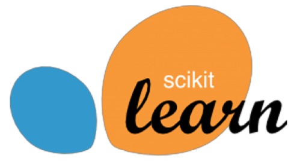

<html>
    <body>
        

        
        

        

        <h2 style="text-align: center"> Howdy 🤠</h2>
        
My name is Sophie, and I'm an experienced Analyst actively working to expand my technical skillset. Here you'll find a collection of my "after-hours" projects including (but not limited to) my published Codecademy coursework and machine learning projects!

        

         
        

         
        

        
        

        

        <h2 style="text-align: center">Projects</h2>
            

            <table>
                <tr>
                <th>Repo</th>
                <th>Project Name</th>
                <th>Keywords</th>
                <th>Status</th>
                </tr>
                <tr>
                <td><a href="https://github.com/srmarshall0/machine_learning_projects.git">Machine Learning Projects</td>
                <td>California Housing Prices</td>
                <td>Linear Regression, KMeans, Decision Tree, Random Forest, Grid Search, Randomized Search</td>
                <td>Complete</td>
                </tr>
                <tr>
                <td><a href="https://github.com/srmarshall0/machine_learning_projects.git">Machine Learning Projects</td>
                <td>MNIST Handwriting Classifier</td>
                <td>Classification, Stochastic Gradient Descent, Random Forest, K-Nearest Neighbors </td>
                <td>On Pause</td>
                </tr>
                <tr>
                <td><a href="https://github.com/srmarshall0/sophies_spotify.git">Sophie's Spotify</td>
                <td>Spotify Listening History Database</td>
                <td>Batch Processing, API, ETL</td>
                <td>Improving</td>
                </tr>
            </table>
            

        

         
        

         
        

        
        

        

            <h2 style="text-align: center">Language and Tools</h2>
            

                <table width="100%" style="margin: 0px;">
                    <tr>
                    <th>Competency</th>
                    <th>Language / Tool</th>
                    </tr>
                    <tr>
                    <td>Beginner</td>
                    <td>
                        </td>
                    </tr>
                    <tr>
                    <td>Intermediate</td>
                    <td>
                        
                        
                        </td>
                    </tr>
                    <tr>
                    <td>Advanced</td>
                    <td>
                        </td>
                    </tr>
                </table>
            

        

         
        

         
        

        
        

        

            <h2 style="text-align: center">Still Reading? Let's Connect!<h2>
            

                
                
                
            

        
                      
    </body>
</html>
